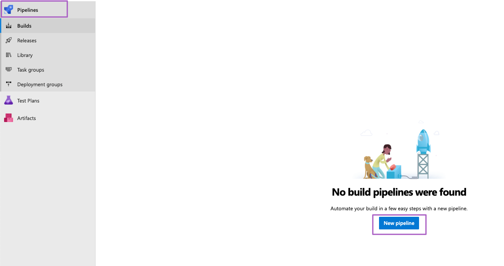
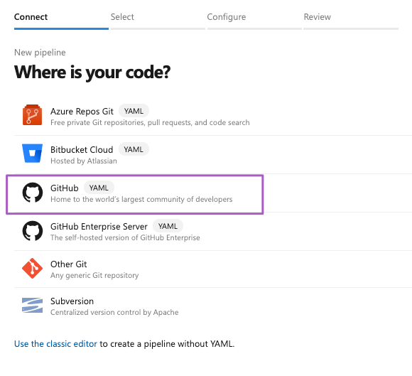
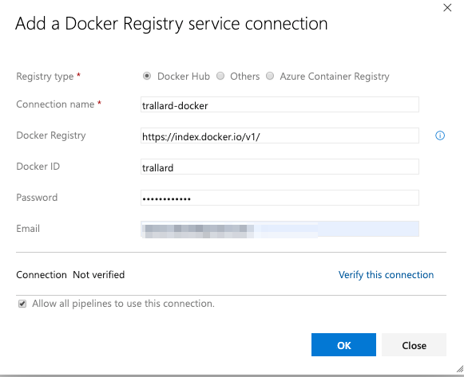

# Introduction to Azure Pipelines
- [Introduction to Azure Pipelines](#introduction-to-azure-pipelines)
  - [💻 What you'll be doing](#%f0%9f%92%bb-what-youll-be-doing)
  - [🛠 Azure DevOps setup](#%f0%9f%9b%a0-azure-devops-setup)
  - [📝 Understanding the Azure Pipeline Build](#%f0%9f%93%9d-understanding-the-azure-pipeline-build)
  - [👩🏿‍💻 Hands on](#%f0%9f%91%a9%f0%9f%8f%bf%e2%80%8d%f0%9f%92%bb-hands-on)
    - [🛠 Setting your pipeline](#%f0%9f%9b%a0-setting-your-pipeline)
    - [🐍 Python specific pipelines](#%f0%9f%90%8d-python-specific-pipelines)
    - [🐍 Multiple Python versions](#%f0%9f%90%8d-multiple-python-versions)
    - [🖥👾 Adding multi OS support](#%f0%9f%96%a5%f0%9f%91%be-adding-multi-os-support)
    - [🖥🐍 Using conda environments](#%f0%9f%96%a5%f0%9f%90%8d-using-conda-environments)
    - [🖥 Complex pipelines: using templates](#%f0%9f%96%a5-complex-pipelines-using-templates)
    - [🐳 Plus: Docker with Azure pipeliens](#%f0%9f%90%b3-plus-docker-with-azure-pipeliens)
      - [Using a Dockerfile](#using-a-dockerfile)


You can use Azure pipelines to test, build and deploy your Python (or any other language) projects without needing to set up any insfrastructure of your own.

For this tutorial we will use the [Microsoft-hosted agents](https://docs.microsoft.com/azure/devops/pipelines/agents/hosted?view=azure-devops&WT.mc_id=rse19-github-taallard) with Python preinstalled - note that these can be Windows, Linux or MacOS based.

## 💻 What you'll be doing

1. Create a new Azure DevOps CI pipeline
2. Create a basic CI pipeline that will run automated `pytests` for your bokeh apps
3. Create a more complex pipelines that use Anaconda to test on Windows, Linux and MacOs
4. Create a pipeline to work on an Azure notebook

## 🛠 Azure DevOps setup

1. Head over to [Azure DevOps](https://azure.microsoft.com/services/devops/?WT.mc_id=rse19-github-taallard) click on Start for free (note you can directly link to your GitHub account).
2. Once registered you need to create an organisation for your products. This will allow you to work with your collaborators in multiple shared-projects.

When prompted to choose the location for your projects make sure to choose a close by region to you. For example, for this workshop we could use WestEurope.
3. Once completed you can sign into your organisation at any time through ``http://dev.azure.com/{your_org}``.
4. We now need to create a new project. Click on the **+ Create project** button 


Make sure to give your project a meaningful name and add a sensible description.


Then click on **Create**


## 📝 Understanding the Azure Pipeline Build

A build can have multiple stages. Each stage can contain one or more jobs. For example you might have the following stages:
- Test (my code using unittest)
- Build (my awesome app)
- Deploy 

You can imagine a pipeline as a dependency graph:


You can find a list of all the available tasks in the [Pipelines documentation](https://docs.microsoft.com/azure/devops/pipelines/tasks/?view=azure-devops&viewFallbackFrom=vsts&WT.mc_id=rse19-github-taallard). Plus you can define your own tasks using bash or PowerShell.

---

## 👩🏿‍💻 Hands on 
Clone this wokrshop's repo: <https://github.com/trallard/ci-research> to your own GitHub profile.

✨ Let's start by creating our `.azure-pipelines/azure-pipelines.yml` file in our repo. 

```yaml
# Python example Azure Pipeline

trigger:
- master

# specific branch build
pr:
  branches:
    include:
    - master
    exclude:
    - feature/*  # regex wildcard (or any other regex)

```

First we specify what triggers the pipeline, in this case pushing to the master branch. Equally, the `pr` entry determines which cases of Pull Requests will trigger the pipeline as well.

For example, you might not want any pr to build so you can set this to `pr:none` you can also use `regex` to define the builds or triggers.


👉🏼 Read more about [triggers](https://docs.microsoft.com/azure/devops/pipelines/yaml-schema?view=azure-devops&tabs=schema&WT.mc_id=rse19-github-taallard#triggers)


The next step us defining the pool we want to use. Basically this is the OS for your project:. We are going to start with a basic Ubuntu runner:

```yaml
pool:
    vmImage: 'Ubuntu-16.04'
```
And add steps to your pipeline:
```yaml

steps:
- script: echo "Hello World!"
  displayName: "Run AZ pipelines Hello World"

```
Commit your changes and push to your repo.

```
git add azure-pipelines.yml
git push
```

### 🛠 Setting your pipeline

Back in Azure Devops click on **Pipelines > New pipelines** and then select GitHub from the options presented:






DO NOT click on the "Use the clasic editor" .

Select the `azure-pipelines.yml` file in your repo.

Click on save and then run.
You should see your first pipeline run and the logs being displayed.


### 🐍 Python specific pipelines

Replace your steps:


```yaml
trigger:
  - azure-pipelines
  - master

pool:
  vmImage: "ubuntu-16.04"

steps:
- task: UsePythonVersion@0
  displayName: 'Use Python 3.6'
  inputs:
    versionSpec: '3.6'
    architecture: 'x64'
```

The steps: element can contain children like:

`- task:`, which runs a specific task that's defined in Azure DevOps (see the full [Task reference](https://docs.microsoft.com/azure/devops/pipelines/tasks/index?view=azure-devops&WT.mc_id=rse19-github-taallard))

`- script:`, which runs an arbitrary set of commands as you see in a moment. The task in the code above is `UsePythonVersion`, which specifies the version of Python to use on the build agent. The `@<n>` suffix indicates the version of the task; `@0` indicates "preview".

Adding additional steps as if they were bash commands:

```yaml
- script: python -m pip install --upgrade pip
          displayName: "Upgrade pip"

- script: |
    # commands run within the step
    pip install -r requirements.txt
  displayName: 'Install dependencies'

- script: |
    python -m pip install pylint --quiet
    pylint boston/*.py
    pylint iris/*.py
  displayName: 'Run lint tests'

- script: |
    pip install pytest
    python -m pytest tests/
  displayName: 'Test with pytest'
```

Save, commit and see your pipeline run!

### 🐍 Multiple Python versions

You can modify your steps to use a matrix specification:
(👉🏼 see [reference here](https://docs.microsoft.com/azure/devops/pipelines/yaml-schema?view=azure-devops&tabs=example&WT.mc_id=rse19-github-taallard#strategies))

```yaml
trigger:
  - azure-pipelines
  - master

pool:
  vmImage: 'Ubuntu-16.04'
strategy:
  matrix:
    Python35:
      python.version: '3.5'
    Python36:
      python.version: '3.6'
    Python37:
      python.version: '3.7'

steps:
- task: UsePythonVersion@0
  inputs:
    versionSpec: '$(python.version)'
  displayName: 'Use Python $(python.version)'

- script: |
    python -m pip install --upgrade pip
    pip install -r requirements.txt
  displayName: 'Install dependencies'

- script: |
    pip install pytest pytest-azurepipelines
    pytest
  displayName: 'pytest'

```
Commit your changes and you should be able to see the pipeline run.

🚥 Add a step script for linting using pylint:
```
1. install pylint from pip
2. lint the boston/*.py and iris/*.py files
```

### 🖥👾 Adding multi OS support 

<details>
  <summary>👇🏽 Click to expand!</summary>
  
You can add Windows, Mac OS and Ubuntu runners to your environment, this allows you to have a more extensive set of tests within one single CI provider.

```yaml
trigger:
  - azure-pipelines
  - master

jobs:
  - job: Ubuntu_testing
    # https://docs.microsoft.com/en-us/azure/devops/pipelines/yaml-schema?view=azure-devops&tabs=schema#pool
    pool:
      vmImage: 'Ubuntu-16.04'
    strategy:
      matrix:
        Python36:
          python.version: '3.6'
        Python37:
          python.version: '3.7'

    steps:
      - task: UsePythonVersion@0
        displayName: 'Get Python version $(python.version)'
        inputs:
          versionSpec: '$(python.version)'
          architecture: 'x64'
      - script: python -m pip install --upgrade pip
        displayName: "Upgrade pip"
      - script: |
          # commands run within the step
          pip install -r requirements.txt
        displayName: 'Install dependencies'
      - script: |
          python -m pip install pylint --quiet
          pylint boston/*.py
          pylint iris/*.py
        displayName: 'Run lint tests'
      - script: |
          pip install pytest pytest-azurepipelines
          python -m pytest tests/
        displayName: 'Test with pytest'

  - job: Windows_unit_test
      pool:
        vmImage: 'windows-2019'

      strategy:
        matrix:
          Python36:
            python.version: '3.6'
          Python37:
            python.version: '3.7'

      steps:
        - task: UsePythonVersion@0
          displayName: 'Get Python version $(python.version)' 
          inputs:
            versionSpec: '$(python.version)'
            architecture: 'x64'
          
        - script: python -m pip install --upgrade pip
          displayName: "Upgrade pip"

        - script: |
            # commands run within the step
            pip install -r requirements.txt
          displayName: 'Install dependencies'

        - script: |
            pip install pytest pytest-azurepipelines
            python -m pytest tests/ 
          displayName: 'Test with pytest'
  ```

</details>


### 🖥🐍 Using conda environments 

<details>

<summary>👇🏽 Click to expand!</summary>

You can also use and create conda environments within your builds. 
Let's create a `.azure-pipelines/conda.yml` file:

```yaml
trigger:
  - pipelines
  - master

jobs:
  - job:
    displayName: Anaconda_ubuntu
    pool:
      vmImage: "ubuntu-16.04"
    strategy:
      matrix:
        Python36:
          python.version: "3.6"
        Python37:
          python.version: "3.7"
    steps:
      - bash: echo "##vso[task.prependpath]$CONDA/bin"
        displayName: Add conda to PATH

      - bash: conda create --yes --quiet --name testingEnv
        displayName: Create Anaconda environment

      - bash: |
          source activate testingEnv
          conda install --yes --quiet --name testingEnv python=$PYTHON_VERSION --file requirements.txt
        displayName: Install Anaconda packages

      - bash: |
          source activate testingEnv
          pip install pytest pytest-azurepipelines
          python -m pytest tests/
        displayName: pytest
```

Now we can create a new pipeline. Go to Pipelines > + new > GitHub > Existing yaml file.

This will add a whole new pipeline to your CI, which can have different triggers, environments, tests and builds.

</details>


### 🖥 Complex pipelines: using templates

<details>
<summary>👇🏽 Click to expand!</summary>

Sometimes you want to be able to use complex setups without your yaml becoming too convoluted. 
For these cases you can create "templates" and import them within your yaml file.

Let's create a `.azure-pipelines/ci.yml` file:

```yaml
#  using templates for the pipeline
trigger:
  - azure-pipelines
  - master

jobs:
  - job:
    displayName: Anaconda_ubuntu
    pool:
      vmImage: "ubuntu-16.04"
    strategy:
      matrix:
        Python36:
          python.version: "3.6"
        Python37:
          python.version: "3.7"

    # using template
    steps:
      - template: ./anaconda.yml

  # testing in MacOS
  - job:
    displayName: MacOS_test
    pool:
      vmImage: "macOS-10.13"
    strategy:
      matrix:
        Python37:
          python.version: "3.7"

    steps:
      - template: ./anaconda.yml

  #  using TOX for the tests
  - job:
    displayName: TOX_tests
    pool:
      vmImage: "ubuntu-16.04"
    strategy:
      matrix:
        py36:
          python.version: "3.6"
          tox.env: py36
        py37:
          python.version: "3.7"
          tox.env: py37
        py36-black:
          python.version: "3.6"
          tox.env: py36-black

    steps:
      - task: UsePythonVersion@0
        displayName: "Use Python $(python.version) for tests"
        inputs:
          versionSpec: "$(python.version)"
          architecture: "x64"

      - script: pip install -U pip
        displayName: "Upgrade pip"

      - script: pip install tox
        displayName: "Install tox"

      - script: tox -e $(tox.env)
        displayName: "Run tox -e $(tox.env)"
```
And an anaconda template `.azure-pipelines/anaconda.yml`

```yml
steps:
  - bash: echo "##vso[task.prependpath]$CONDA/bin"
    displayName: Add conda to PATH

  - bash: conda create --yes --quiet --name testingEnv
    displayName: Create Anaconda environment

  - bash: |
      source activate testingEnv
      conda install --yes --quiet --name testingEnv python=$PYTHON_VERSION --file requirements.txt
    displayName: Install Anaconda packages

  - bash: |
      source activate testingEnv
      pip install pytest pytest-azurepipelines
      python -m pytest tests/
    displayName: pytest
```

</details>


### 🐳 Plus: Docker with Azure pipeliens

Note that you need a DockerHub account to complete all of this section. Though you can omit the pushing your image. 


<!-- <details> -->
<summary>👇🏽 Click to expand!</summary>

First you need to create a connection service to access DockerHub. This will help us to keep our password secret.

To do this click on `project settings > service connection > new service connection >  docker registry` 


Give your connection a name and fill in with your Docker details:



#### Using a Dockerfile

If you already have a Dockerfile in place we can straight away  create a new pipeline `./azure-pipelines/dockerfile.yml`

```yml
# Docker
# Build a Docker image 
# https://docs.microsoft.com/azure/devops/pipelines/languages/docker

trigger:
   - master
   - pipelines

pool:
  vmImage: 'Ubuntu-16.04'

variables:
  imageName: 'ci-research'

steps:
- task: Docker@2
  displayName: Login to DockerHub
  inputs:
    command: login
    containerRegistry: trallard-docker
- task: Docker@2
  displayName: Build an image and push to DockerHub
  inputs:
    repository: trallard/$(imageName)
    tags: $(Build.BuildId)
    command: buildAndPush
    Dockerfile: **/Dockerfile
```

You can learn more about the Docker tasks 👉🏼[here](https://docs.microsoft.com/azure/devops/pipelines/tasks/build/docker?view=azure-devops&WT.mc_id=RSE-github-taallard)

<!-- </details> -->
