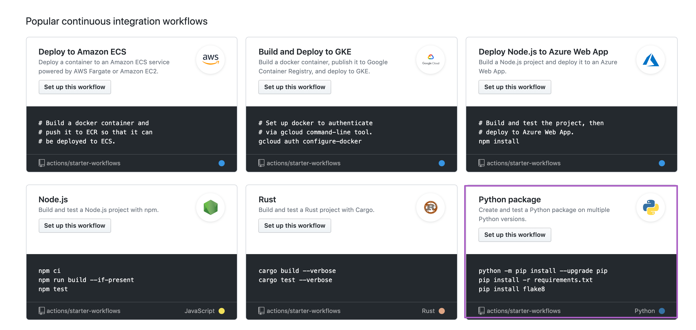
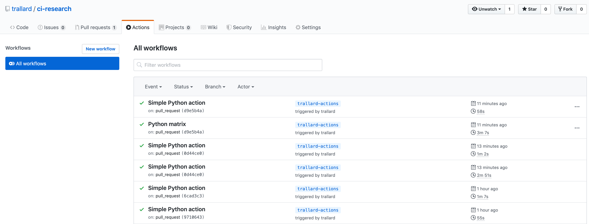

# Introduction to GitHub Actions

- [Introduction to GitHub Actions](#introduction-to-github-actions)
  - [Getting started](#getting-started)
  - [Matrices by version and OS](#matrices-by-version-and-os)

You can find the official documentation on getting started with GitHub actions [here](https://help.github.com/en/actions/automating-your-workflow-with-github-actions/about-github-actions).

And the syntax [here](https://help.github.com/en/actions/automating-your-workflow-with-github-actions/workflow-syntax-for-github-actions)

## Getting started 

Go to your repository and click on `actions` then select Python workflow:



This will create a basic action workflow for you in `.github/workflows`.

Let's make some chenges to the file:

```yaml
name: Simple Python action
on:
  pull_request:
    branches:
    - master
  push:
    branches:
    - <your username>/*

jobs:
  build:
    runs-on: ubuntu-18.04
    strategy:
      max-parallel: 4
      matrix:
        python-version: [3.5, 3.6, 3.7]

    steps:
    - uses: actions/checkout@v1
    - name: Set up Python ${{ matrix.python-version }}
      uses: actions/setup-python@v1
      with:
        python-version: ${{ matrix.python-version }}
    - name: Install dependencies
      run: |
        python -m pip install --upgrade pip
        pip install -r requirements.txt
    - name: Test with pytest
      run: |
        pip install pytest
        python -m pytest tests/

```

In this case we will be using  a matrix to test different versions of Python on Ubuntu. 

Let's save it and create a PR to our repo.

You should be able to head over to actions and see the logs of your CI



## Matrices by version and OS

Similar to Azure pipelines you can create a matrix for the different hosted runners and versions of your programming languages. 

Let's pull the repo locally and checkout the created branch:

```sh
git pull
git checkout branch <yourusername>/actions
```

And let's create a new file `./github/workflows/pythonmatrix.yml`

```yml
name: Python matrix
on:
  pull_request:
    branches:
    - master
  push:
    branches:
    - trallard/*


jobs:
  test:
    name: Test on python${{ matrix.python_version }} and ${{ matrix.os }}
    runs-on: ${{ matrix.os }}
    strategy:
      matrix:
        python-version: ['3.6', '3.7']
        os: [ubuntu-latest, windows-latest, macOS-latest]

    steps:
    - uses: actions/checkout@v1
    - name: Set up Python ${{ matrix.python-version }}
      uses: actions/setup-python@v1
      with:
        python-version: ${{ matrix.python-version }}

    - name: Install dependencies
      run: |
        python -m pip install --upgrade pip
        pip install -r requirements.txt
    - name: Test with pytest
      run: |
        pip install pytest
        python -m pytest tests/

```

Design your own actions for some scenarios!!!